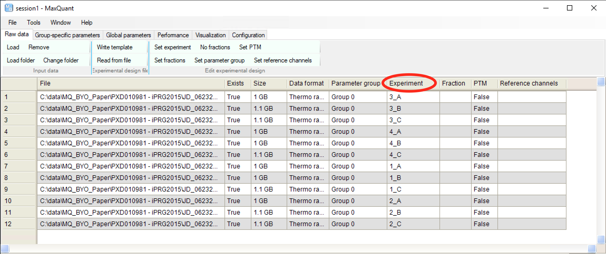

# LFQproceessing

The LFQProcessing R package enables users to load and process the output of the [MaxQuant Computational Platform](https://www.maxquant.org/) for processing LC-MS/MS proteomics data. This package contains utilities for performing differential expression DE statistics and Quality Control reports. 

A sister R package [MassExpression](www.massdynamics.com), provides the same utilities for a generic format, and will be the focus of future development.

Both LFQProcessing and MassExpression were developed by [MassDynamics](www.massdynamics.com) to enable greater accessibility, reproducibility and insight into proteomics datasets and insights. All feedback is welcome. 

For more details please see our biorXiv paper: [Mass Dynamics 1.0: A streamlined, web-based environment for analyzing, sharing and integrating Label-Free Data](https://doi.org/10.1101/2021.03.03.433806).

# Installation

The latest release of LFQProcessing is installable using 

```{r}
install_github("MassDynamics/lfq_processing")
```

For further reproducibility. The package repository contains an renv.lock file that
can be used to restore a working R 4.1.0 environment for running LFQProccesing by running
`renv::restore()`


## Running LFQProcessing on your maxquant data.

### Retrieving data for running LFQProcessing.

The first step is to assign variables that point to the location of the maxquant output files and to the cloned git repository.

```r
mq_folder = "/home/ubuntu/data/mq-test/"
app_folder = "/home/peppe/maxquant-quant-analysis-public/"
```

The _mq_folder_ has to contain these files:

- _evidence.txt_
- _modificationSpecificPeptides.txt_
- _msms.txt_
- _parameters.txt_
- _peptides.txt_
- _proteinGroups.txt_
- _summary.txt_


### Experimental design info

Experimental dessign needs to be written in a tab separated file formatted like the example below:

| file_name | replicate | experiment | mqExperiment |
|------:|------:|------:|------:|
JD_06232014_sample1_A|1|sample1|1_A
JD_06232014_sample1_B|2|sample1|1_B
JD_06232014_sample1_C|3|sample1|1_C
JD_06232014_sample2_A|1|sample2|2_A
JD_06232014_sample2_B|2|sample2|2_B
JD_06232014_sample2_C|3|sample2|2_C
JD_06232014_sample3_A|1|sample3|3_A
JD_06232014_sample3_B|2|sample3|3_B
JD_06232014_sample3_C|3|sample3|3_C
JD_06232014_sample4_A|1|sample4|4_A
JD_06232014_sample4_B|2|sample4|4_B
JD_06232014_sample4_C|3|sample4|4_C

Where the column __file_name__ contains the names of the LC-MS/MS runs in the data, the column __experiment__ contains the experimental conditions, the column __replicate__ is a unique number for each of the biological or technical replicate in one experimental contition, the column __mqExperiment__ contains the values in the "Experiment" column in the Maxquant "Raw data" tab when setting up the Maxquant analysis (figure below).



Maxquant experimental set up. Each "File" has to be associated to a unique value in the "Experiment" column

Save this file with the name "experimentDesign_original.txt" in your Maxquant .txt folder.

--- 

## Quantitative analysis

To run the quantitative analysis end-to end, all you need to do is write paths to your Maxquant .txt 
and to an output folder where you would like to store the output. 

```r
protein_quant_runner(maxquant_folder, output_folder)
```

## Example Data:

Example data is provided with the package. To run this data you can use the following code:

```{r}
data("example_lfq_her2_targetted_therapy")

# Run Code
output =  lfq_transformer(ma_tables = example_lfq_her2_targetted_therapy_tables,
                                 output_folder = "./sample_data_her/",
                                 imputeStDev=0.3,
                                 imputePosition=1.8)

# output[[1]] is the protein level DE statistics. 
# Make a Volcano Plot
plot(output[[1]]$`logFC AZD8931_resistant_SKBR3_AZDRc - Parental_SKBR3`, 
     -log10(output[[1]]$`P.Value AZD8931_resistant_SKBR3_AZDRc - Parental_SKBR3`))
```


